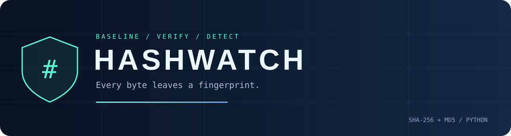

<p align="center"></p>

<p align="center"><b>Save a baseline. Check the bytes. Spot the change.</b></p>

A small Python CLI that compares files against saved **SHA-256 + MD5** fingerprints. Includes colored status messages and a quick terminal banner animation.

### Run

```bash
pip install -r requirements.txt
python file_integrity_checker.py
```

Python 3 required. Colorama is optional; plain-text output works without it.

### The menu

| Option | Action |
| :--- | :--- |
| **1** | Save one or more files to the baseline (comma-separated paths) |
| **2** | Check for **UNCHANGED**, **MODIFIED**, or **MISSING** files |
| **3** | Show stored hashes and timestamps |
| **4** | Exit |

Hashes are calculated in **4096-byte chunks** and saved in `baseline.json` in your working directory. Both hashes must match for an unchanged result. Adding an existing path again replaces its baseline.

### Try it

Add a test file with option **1**, edit and save it, then choose **2** to see `MODIFIED`. Delete the test file and check again to see `MISSING`.

<sub>Checks run on demand. A match means the file matches the saved baseline; it does not prove the file is safe. Keep your baseline trusted. Set NO_ANIMATION=1 to disable the startup effect.</sub>

### Credits

Adapted from [Bisma's File Integrity Checker](https://github.com/codedbyBisma/File_Integrity_Checker). This version adds HASHWATCH branding, short comments, and terminal presentation changes while preserving the supplied hashing and comparison logic. No upstream license was included in the supplied material.
